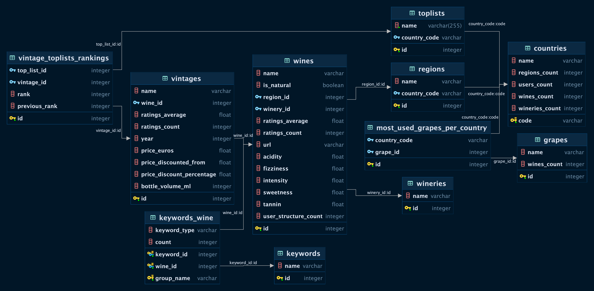

# Wiwino Wine Market Analysis

## Introduction

Wiwino is a company deeply involved in the wine industry, gathering extensive data from its users over the years. This project aims to provide a comprehensive market analysis based on the data collected.

## Installation

To run this project, follow these steps:

1.  Clone the repository to your local machine:

    bash

- `git clone git@github.com:JaggarYussef/Wiwino.git`
- Navigate to the project directory:

  bash

- `cd wiwino-analysis`
- Install the required Python packages:

1.  `pip install -r requirements.txt`

## Running the Analysis

To run the analysis, execute the main script:
`python main.py`

## Data

The data provided by Wiwino is stored in an SQLite database, which can be found in the root folder.

## Database Schema



## SOLUTIONS

### Question 1: Top 10 Underrated Wines

We aim to identify the top 10 wines with high rankings and ratings average in vintage toplist while having relatively low ratings count. These wines are considered good but less reviewed, potentially offering hidden gems for wine enthusiasts.

```sql
SELECT DISTINCT wines.id, wines.name, vintage_toplists_rankings.rank, wines.ratings_average, wines.ratings_count, vintages.price_euros
FROM wines
JOIN vintages ON vintages.wine_id = wines.id
JOIN vintage_toplists_rankings ON vintage_toplists_rankings.vintage_id = vintages.id
WHERE vintages.price_euros < 50
GROUP BY wines.id
ORDER BY wines.ratings_count DESC, vintage_toplists_rankings.rank DESC
LIMIT 10
```

#### Query Result:

| id      | name                                           | rank | ratings_average | ratings_count | price_euros |
| ------- | ---------------------------------------------- | ---- | --------------- | ------------- | ----------- |
| 11890   | 60 Sessantanni Old Vines Primitivo di Manduria | 17   | 4.5             | 94289         | 24.75       |
| 7103    | Amarone della Valpolicella Classico            | 4    | 4.3             | 77515         | 49.80       |
| 1139434 | Tinto                                          | 1    | 4.4             | 65625         | 42.95       |
| 11604   | Malleolus                                      | 18   | 4.3             | 34630         | 35.95       |
| 1174845 | Sauternes (Premier Grand Cru Classé)           | 4    | 4.3             | 17293         | 49.90       |

These wines are selected based on their impressive rankings and ratings, despite having relatively lower ratings counts, making them potentially interesting choices for customers seeking new and underrated wines.

### Question 2: Country to Invest in for Wine Market Expansion

We aim to identify the country where Wiwino should prioritize its marketing efforts based on the number of users and the assortment of wines available. Specifically, we look for countries with a high number of users but a relatively low number of wine assortments, indicating potential untapped markets.

```sql
SELECT
    DISTINCT countries.name,
    countries.users_count,
    countries.wines_count,
    countries.wineries_count,
    (CAST(countries.wines_count AS REAL) /  countries.users_count) AS wine_per_user
FROM
    countries
GROUP BY
    countries.name
ORDER BY
    wine_per_user ASC,
    countries.wines_count ASC,
    countries.users_count DESC,
    countries.wineries_count;
```

#### Query Result:

| name       | users_count | wines_count | wineries_count | wine_per_user |
| ---------- | ----------- | ----------- | -------------- | ------------- |
| États-Unis | 12273684    | 204060      | 28145          | 0.016626      |
| Suisse     | 1601799     | 33656       | 3849           | 0.021011      |
| Roumanie   | 228185      | 6841        | 686            | 0.029980      |

Based on this analysis, Wiwino should consider investing in countries like United States and Switzerland where the supply for wines is relatively low compared to the number of users, presenting potential opportunities for market expansion.

### Question 3: Top Three Wineries

We aim to identify the top three wineries based on their ratings average and ratings count. Due to missing data and limitations, we could only return three wineries that had sufficient data for analysis. We prioritize wineries with the most positive reviews and ratings counts.

```sql
SELECT wineries.id, wineries.name, wines.winery_id, wines.name, wines.ratings_average, wines.ratings_count
FROM wineries
JOIN wines ON wines.winery_id = wineries.id
GROUP BY wines.winery_id
ORDER BY wines.ratings_count DESC
LIMIT 3
```

#### Query Result:

| id   | name                       | winery_id | name                             | ratings_average | ratings_count |
| ---- | -------------------------- | --------- | -------------------------------- | --------------- | ------------- |
| 1471 | Siepi                      | 1471      | Lion Tamer Napa Valley Red Blend | 4.3             | 4981          |
| 1651 | Tenuta Tignanello 'Solaia' | 1651      | The Armagh Shiraz                | 4.5             | 2472          |
| 1652 | Tignanello                 | 1652      | Colheita Porto                   | 4.4             | 741           |

These top three wineries have demonstrated high ratings averages and substantial ratings counts, indicating their popularity and positive reception among consumers.

### Question 5: Best Rated Wines by Grape Type and Availability

We aim to identify the best-rated wines by grape type and availability. This analysis focuses on wines with ratings average greater than 4.5, grouped by grape type and sorted based on ratings average and wines count.

```sql
SELECT DISTINCT
    most_used_grapes_per_country.grape_id,
    grapes.name,
    most_used_grapes_per_country.country_code,
    most_used_grapes_per_country.wines_count,
    wines.ratings_average
FROM
    most_used_grapes_per_country
JOIN
    grapes ON grapes.id= most_used_grapes_per_country.grape_id
JOIN
    countries ON countries.code =  most_used_grapes_per_country.country_code
JOIN
    regions ON regions.country_code = countries.code
JOIN
    wines ON wines.region_id = regions.id
WHERE
    wines.ratings_average > 4.5
GROUP BY
    most_used_grapes_per_country.grape_id
ORDER BY
    wines.ratings_average DESC, most_used_grapes_per_country.wines_count DESC
```

#### Query Result:

| grape_id | name               | country_code | wines_count | ratings_average |
| -------- | ------------------ | ------------ | ----------- | --------------- |
| 1        | Shiraz/Syrah       | au           | 551112      | 4.7             |
| 2        | Cabernet Sauvignon | us           | 801751      | 4.6             |
| 5        | Chardonnay         | it           | 604208      | 4.6             |
| 14       | Pinot Noir         | us           | 572334      | 4.6             |
| ...      | ...                | ...          | ...         | ...             |

These results showcase the best-rated wines for each grape type, along with their availability and ratings averages. It provides valuable insights for wine enthusiasts and connoisseurs seeking exceptional wines based on grape varieties.

### Question 6: Average Wine Rating for Each Country

We aim to calculate the average wine rating for each country, providing insights into the overall wine quality from different regions. The query retrieves data on countries, wine ratings average, and calculates the average rating across all wines for each country.

```sql
SELECT
    countries.name,
    wines.ratings_average,
    AVG(wines.ratings_average) AS average
FROM
    countries
JOIN
    regions ON regions.country_code = countries.code
JOIN
    wines ON wines.region_id = regions.id
GROUP BY
    countries.name
ORDER BY
    average DESC
```

#### Query Result:

| name       | ratings_average | average  |
| ---------- | --------------- | -------- |
| Allemagne  | 4.4             | 4.500000 |
| Israël     | 4.5             | 4.500000 |
| États-Unis | 4.3             | 4.490541 |
| Moldavie   | 4.5             | 4.480000 |
| ...        | ...             | ...      |

These results provide insights into the average wine ratings for each country, indicating the overall wine quality perceived by consumers. Countries with higher average ratings may signify regions known for producing exceptional wines.

### Question 7: Top Choices for Cabernet Sauvignon

We aim to identify the top choices for Cabernet Sauvignon wines based on their ratings. This analysis focuses on retrieving the top-rated Cabernet Sauvignon wines, providing insights into the highest-rated options for enthusiasts of this grape variety.

```sql
SELECT
    grapes.name AS grape_name,
    wines.name,
    wines.ratings_average
FROM
    grapes
JOIN
    most_used_grapes_per_country ON most_used_grapes_per_country.grape_id = grapes.id
JOIN
    regions ON regions.country_code = most_used_grapes_per_country.country_code
JOIN
    wines ON wines.region_id = regions.id
WHERE
    grapes.name = 'Cabernet Sauvignon'
ORDER BY
    wines.ratings_average DESC
LIMIT 5
```

#### Query Result:

| grape_name         | name                                 | ratings_average |
| ------------------ | ------------------------------------ | --------------- |
| Cabernet Sauvignon | Cabernet Sauvignon                   | 4.8             |
| Cabernet Sauvignon | Mágico                               | 4.8             |
| Cabernet Sauvignon | IX Estate Red                        | 4.7             |
| Cabernet Sauvignon | Special Selection Cabernet Sauvignon | 4.7             |
| Cabernet Sauvignon | Unico Reserva Especial Edición       | 4.7             |

These results highlight the top choices for Cabernet Sauvignon wines, providing valuable information for enthusiasts seeking exceptional options within this grape variety.

## SQL Query Optimization Techniques:

Optimizing SQL queries is essential for improving database performance. Here are some techniques to optimize the provided SQL queries:

1. **Indexing**: Ensure that columns used in JOIN, WHERE, GROUP BY, and ORDER BY clauses are properly indexed to speed up data retrieval and filtering.

2. **Aggregate Functions**: Use appropriate aggregate functions like MAX(), MIN(), AVG(), or COUNT() to efficiently perform calculations and eliminate duplicate rows.

3. **Subquery Optimization**: Use subqueries to filter data before joining if possible, especially for large tables, to reduce the amount of data processed.

4. **Limiting Data Retrieval**: Retrieve only the necessary columns and limit the result set size using techniques like DISTINCT and LIMIT to minimize data transfer and processing.

5. **Join Strategies**: Evaluate different join strategies (INNER JOIN, LEFT JOIN, etc.) and choose the most efficient one based on the data distribution and query plan.

6. **Caching Aggregates**: If certain aggregate results are relatively static, consider caching them to avoid recalculating them for every query.

7. **Avoid Redundant Joins**: Ensure that join conditions are necessary and optimized to avoid unnecessary data retrieval and processing.

8. **Data Filtering**: Filter data as early as possible using WHERE clauses to reduce the amount of data processed during joins and aggregations.

By applying these optimization techniques, SQL queries can be made more efficient, resulting in improved database performance and responsiveness.

### Improving Data Quality, Database Schema, and Typing:

To enhance the data quality, database schema, and typing, several improvements can be implemented:

1. **Data Integrity Constraints**: Enforce stricter rules for adding wines with existing wineries to maintain data integrity. This ensures that each wine is correctly associated with its respective winery, reducing issues with data inconsistency.

2. **Additional Foreign Keys**: Introduce more foreign keys to establish relationships between tables, particularly for referencing wines with sales data. This facilitates easier querying and analysis, especially when determining the number of sales for wines listed in top_list tables.

3. **Normalization and Denormalization**: Evaluate the current schema for normalization opportunities to reduce redundancy and improve data organization. Conversely, consider denormalization where appropriate to optimize query performance for frequently accessed data.

4. **Clear Column Definitions**: Resolve ambiguity in column definitions, such as the "user_structure_count" in the wines table. Clearly define the purpose and meaning of each column to avoid confusion and ensure consistency in data interpretation.

By implementing these improvements, the overall data quality, database schema structure, and typing consistency can be enhanced, leading to better data management, improved query performance, and more accurate analysis results.
